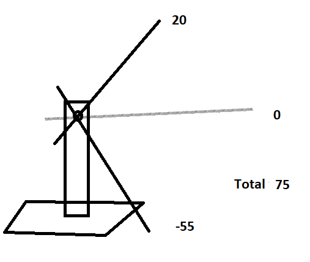

## PID Controller

PID - a proportional-integral-derivative or three-term controller is a mechanism to control process variable value, based on the feedback. Mainly used in systems and applications, which require to continuously control unstable value. As an example from everyday life, I can talk about cruise control systems in cars. The car brain, or main controller, compares the car's real speed with desired for hill ascending and descending. Then the PID algorithms are applied to control the engine power, i.e. increase or decrease it, to save vehicle resources. Also, we have applied PID algorithm in person detection experiment with drone. There we measured the difference between the detected person's bounding box center and image center and changed the yaw angle of the drone accordingly to minimize this error.

### Main principles

The main definitions of the PID are the following. First, we have a desired setpoint (SP) - this is the value, that our process should maintain constantly. In drone experiment it was the difference between the centers, and it should be ideally be equal to 0. Second we have a real value of process variable (PV), that we get as an input to our PID algorithm. In drone experiment it was the real box centers' difference. So having two values we calculate the error, the difference we want to eliminate.


This is where PID algorithm start to work. the formula of it can be written as 

PID = P + I + D

### P Component

P is a proportional to the error value control. The larger the error, the larger the P, and vice versa. To adjust it koefficient Kp is used. But the main idea is that this control works only if there is an error.

P=Kp * e 


, where Kp is an adjustable coefficient.

### I Component

I is an integral control. This component integrates or in other words, sums up all the past errors.

I=Ki*sum(e)


The main focus of I control is to eliminate residual error of system. When the error is close to 0, 	the integral component will stop growing.

### D Component

D or derivative control is related to the speed of value change.

D = Kd*de/dt


here 
 


 is time since last error measurement.

This value will be bigger with the lower time of change dt, meaning the faster value changes, the higher effect of D control would be felt. It is sometimes called "anticipatory control", as it tries to estimate the future trend of value change based on current rate.

 
### The Arm Schematic and components


Components:

  - DC Motor
  - ESP8266 controller
  - MPU9250 sensor (placed on the arm)
  - Potentiometer B10K, 10 kOm resistance
  - Logic level mosfet
  - 2 Resistors, 100 Om and 10 kOm
  - Diod
  - Power Station (settings: 3.8 Volts, Max Amper)

### Arduino code

Built tool's limitations



```c++
// importing libraries
#include "MPU9250.h" // sensor library
#include "math.h"  // math operations

//define pins
#define MOTOR D3   // pin for motor control
#define PIN_POT  A0  //pin for potentiometer value reading

MPU9250 mpu;  // sensor instance

// initial control values
float kp=6.8;
float ki=0.1;
float kd=1.8;
float multiplier=1; // multiplier variable is used to magnitude the P I D values at the same time by the same factor
float error;
float ki_error_range=10;
float desired_yaw=38.0;
float pError=0.0;
float current_yaw=0.0;
float PID_p, PID_i, PID_d, PID_total;
// time parameters for setting the frequency of reading sensor values
int period = 50; // milliseconds    
float tme;

// serial input value
String serialInput;


void setup() {
  Serial.begin(115200); 
  Wire.begin();
  // connection to MPU sensor
  if (!mpu.setup(0x68)) {  // change to your own address
        while (1) {
            Serial.println("MPU connection failed. Please check your connection with `connection_check` example. Trying to reconnect...");
//            delay(5000);
          if (mpu.setup(0x68)){
            break;
          }
        }
      
        
    }

  // motor and potentiometer to output and input
  pinMode(MOTOR, OUTPUT);
  pinMode(PIN_POT, INPUT);
  // set desired yaw to the value, read from potentiometer
  set_desired_yaw();
  Serial.println("Setup finished");
  tme=millis(); 
}


void set_desired_yaw(){
  // read potentiometer value, range is [1024-10]
  int rot_1024= analogRead(PIN_POT);
  // convert to 255 units system
  int rot_255 = 255*(1024 - rot_1024)/1014;
  // set desired yaw
  if (rot_255<=141){
    desired_yaw=38+rot_255;
    }
    else {
      desired_yaw=-179+(rot_255-141);    
      }
  }

void loop() {
  // set desired yaw in accordance to the last read from potentiometer
  set_desired_yaw();  

  // read input from serial monitor
  // format: <variable>=<float value>
  // example: kp=1.5
  if (Serial.available()> 0){ // check if there is an input
    
      serialInput = Serial.readString(); //read input as a string
      int index = serialInput.indexOf('='); // find index of =
      String variable = serialInput.substring(0,index); // find the first part of substring, meaning the variable name
      float value = serialInput.substring(index+1, serialInput.length()).toFloat(); // find the second part of substring, meaning the variable value and convert it to float
    // check variable name and assign the value to the corresponding variable
    if (variable=="kp"){
        kp=value;
    }
    else if (variable=="ki"){
        ki=value;
    }

    else if (variable=="kd"){
        kd=value;
    }
    else if (variable=="kier"){
        ki_error_range=value;
    }
    }

    // check the sensor data
  if (mpu.update()) {     
        if (millis() > tme + period) { // if more than period seconds passed since last read
          
            tme=millis(); // set tme variable to current time in milliseconds

            // read current yaw angle
             current_yaw=mpu.getYaw();
             // error calculation
             
             // if current yaw and desired yaw have the same signs
             if ( current_yaw*desired_yaw >=0){
             error=desired_yaw-current_yaw;
              } else {

                if(current_yaw> 0){
                  error= 179  -current_yaw + 179 - abs(desired_yaw);
                } else{
                    error= -179  -current_yaw -( 179 - abs(desired_yaw));
                  }
                    
                }
        
            // P calculation    
            PID_p = kp * multiplier* error;

            // I calculation
            // I component starts to accumulate and hence to affect the PID total only if it
            // is in range of ki error range 
            if(abs(error) < ki_error_range){
            PID_i = PID_i + (ki *multiplier* error);
            
            } else { // else it is set to zero
              PID_i=0;
           }

            // D calculation
            // pError is previous value of error
            PID_d = kd*multiplier*((error - pError)/(period));

            // Total PID calculation
            PID_total = PID_p + PID_i + PID_d;
            
            // trim the PID value if it is outside of [0-255] range
            
            if (PID_total > 255){
              PID_total =255;
            }

            if (PID_total < 0){
              PID_total =0;
            }

            // print PID and other variables' values
            print_pid();

            // send final PID value to motor
            analogWrite(MOTOR,PID_total);

            // set pError value to current error value
            pError = error;
    }
}
}

// print variable values to Serial Monitor
void print_pid() {
    Serial.print("Current Yaw: ");
    Serial.println(current_yaw, 2);

    Serial.print("Desired Yaw: ");
    Serial.println(desired_yaw, 2);
    Serial.print("Absolute error: ");
    Serial.println(abs(error), 2);
    Serial.print("KP ki ki_error_range kd: ");
    Serial.print(kp);
    Serial.print(" ");
    Serial.print(ki);
    Serial.print(" ");
    Serial.print(ki_error_range);
    Serial.print(" ");
    Serial.println(kd);
    
    Serial.print("PID_Total, P, I, D: ");
    Serial.print(PID_total, 2);
    Serial.print(", ");
    Serial.print(PID_p, 2);
    Serial.print(", ");
    Serial.print(PID_i, 2);
    Serial.print(", ");
    Serial.println(PID_d, 2);
}

// not used
// sending values to PC
// may be useful in future
void sendToPC(int* data)
{
  byte* byteData = (byte*)(data);
  Serial.write(byteData, 2);
}

void sendToPC(float* data)
{
  byte* byteData = (byte*)(data);
  Serial.write(byteData, 4);
}

```


Link to the code in GitHub repository
[[https://github.com/eligosoftware/pid_arm_control/blob/main/sketch_apr29a_new_idea.ino]]

### PID Tuning

Put together, the final formula of PID controller is:

PID = Kp * e + Ki * sum(e) + Kd * de/dt


From this formula you can see, that the only changable parts are K values. This tuning part is most important and most challenging, because generally PID doesn't guarantee optimal solution. There can always be lags in the response to the control, or the proportional relationship between SP and PV, for example, in drone example, between distance and yaw angle, can be incorrect. That is why the K coeffiecients should be manually tuned during experiments. One may find out, that some K values should be set to 0, this means this component is not applied at all. For example, if you set Ki value to 0, it means I 

I=Ki*sum(e) will always be zero.


The commonly accepted way of tuning is following:

First you start changing Kp coefficient, and Ki Kd are set to 0. P value is proportional to error, and this leads to the oscilation of the system. To decrease the oscilations we can decrease Kp. If we want to react faster to changes, we need to take into account also the speed of changes, or Derivative controller D. Remember its formula: <br>

D = Kd*de/dt


Here, the smaller the period between measurements or the bigger the change in error, the bigger will be the final D component.

And finally, you can tune the I component. It affects the final PID value only when error is within the given range relative to desired yaw value. For example, if the error is too small for proportional P controller and the error didn't change since the last measurement, the PID will be zero without I controller.

To change kp, ki and kd in our experiment without changing the code, you can enter: <br>
   * "kp=4" for P coefficient value
   * "ki=2" for I coefficient value
   * "kd=1" for D coefficient value 
   * "kier=20" for I controller range value 

Here the values should be adapted for your device.


For more examples of PID controller see nice videos on Youtube in Resources section.


### Resources

  * PID controller on Wikipedia [[https://en.wikipedia.org/wiki/PID_controller]]
  * PID controller code [[https://github.com/eligosoftware/pid_arm_control]]
  * PID Tuning [[https://www.youtube.com/watch?v=IB1Ir4oCP5k&ab_channel=RealPars]]
  * PID Tuning [[https://www.youtube.com/watch?v=JFTJ2SS4xyA&t=612s&ab_channel=Electronoobs]]